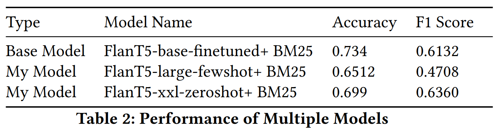

# News-Categorization

### About

This project introduces a revolutionary approach to news categorization, emphasizing personalization. By considering an author's unique writing style and interests, it aims to classify news articles into distinct categories, enhancing the relevance and precision of news categorization.

## Features

- **Personalized Categorization**: Classifies news articles into 15 categories based on author profiles.
- **Advanced Language Modeling**: Utilizes Flan-T5-large for nuanced understanding and generation of categories.
- **Retrieval-Augmented Method**: Employs a retrieval-aligned method for personalizing large language models with user-specific information.
- **Innovative Prompt Engineering**: Incorporates author-specific details for more accurate categorization.

## Dataset

The dataset includes news articles with corresponding category labels and author profiles, forming the basis for our categorization model. To get more details about dataset [click here](https://lamp-benchmark.github.io/download).

## Methodology

1. **Data Preparation**: Utilizes user-based separation settings and text preprocessing techniques.
2. **Retrieval Model (R)**: Implements the BM25 algorithm for efficient document retrieval.
3. **Prompt Construction**: Combines user profile information with article content for personalized prompts.
4. **Language Model (LLM)**: Leverages Flan-T5-large for categorizing articles.

## Evaluation

The project employs comprehensive evaluation methods to assess the effectiveness of personalized categorization against standard models from [LaMP Benchmark](https://arxiv.org/abs/2304.11406).

## Future Scope

This research opens avenues in personalized language models, extending to broader applications in news personalization and NLP.
